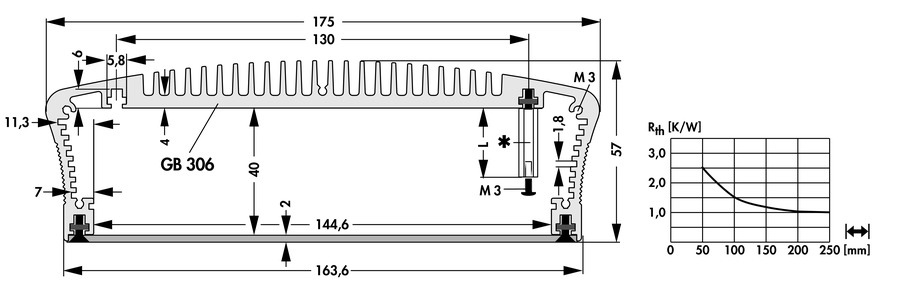

# ClearFog CX LX2160A


- [ClearFog CX LX2160A](#clearfog-cx-lx2160a)
  - [Resources](#resources)
    - [Notes on quickstarting](#notes-on-quickstarting)
    - [Booting](#booting)
    - [Finish install](#finish-install)
    - [make dpmac auto-configure on boot](#make-dpmac-auto-configure-on-boot)
  - [Gotchas, Fixes, headaches](#gotchas-fixes-headaches)
    - [Bug: `fdtfile` is not set correctly during u-boot, Retimers not set for 25/50/100G, general QSFP errors](#bug-fdtfile-is-not-set-correctly-during-u-boot-retimers-not-set-for-2550100g-general-qsfp-errors)
    - [Bug: CRC boot error](#bug-crc-boot-error)
    - [Bug: Docker/make/X doesn't work](#bug-dockermakex-doesnt-work)
    - [Get IP address in u-boot](#get-ip-address-in-u-boot)
    - [notes on dtb/dts conversion & debugging with QEMU](#notes-on-dtbdts-conversion--debugging-with-qemu)
  - [mITX cases](#mitx-cases)
  - [Thermal Calculations](#thermal-calculations)

<br clear="right">

## Resources

  

- [Solid-Run ClearFog CX LX2160A Quick Start Guide](https://solidrun.atlassian.net/wiki/spaces/developer/pages/197494288/HoneyComb+LX2+ClearFog+CX+LX2+Quick+Start+Guide) (sometimes outdated)
- [SolidRun lx2160a u-boot repo](https://github.com/SolidRun/lx2160a_build) (only tested for 8_5_2)
- [Wooty-B's collection of fixes/info from discord](https://github.com/Wooty-B/LX2K_Guide)
- [Solid-Run Discord](https://t.co/MaJevmjlC5)

### Quickstarting

Start with provided ubuntu images. By default they are SERDES (serial-deserializer)8_5_2, where SD1=8, SD2=5, SD3=2.
This enables QSFP28 at 10Gx4 (with octopus) and the 4xSFP+ ports.

SERDES lanes map H-E (lane0-3) to QSFP, and the rest to the 4x cage. See page 1912 of the lx2160a Reference Manual.

> Images are raw. use `dd if=` or [Balena Etcher](https://www.balena.io/etcher/) to write

### Booting

Boot pre-built images from NVME:

```sh
# load ubuntu-core.img to address a4000000 in memory (RAM) from mmc card at 0:1 (uSD-card)
# load [interface] [dev:part] [addr] [filename] 
=> load mmc 0:1 0xa4000000 ubuntu-core.img

# load image from memory (address 0xa4000000) into NVME drive
=> nvme scan
=> nvme write 0xa4000000 0 0xd2000

=> boot
```

alternatively write to eMMC

```sh
# show mmc devices
=> mmc list
# load image from mmc0 (uSD)
=> load mmc 0:1 0xa4000000 ubuntu-core.img
# switch to device 1
=> mmc dev 1
# mmc write [start mem-addr] [start blk offset] [blk count]
# writes the above image we wrote to RAM to eMMC blk0
=> mmc write 0xa4000000 0 0xd2000

=> boot
```

### Finish install

Delete and install to disk (NVME)

```sh
fdisk /dev/nvme0n1
# list with p
d # delete partition1
n # new 
p # primary
1 # default
First Sector: 131072
Remove Signature? Yes
w # write

# use new partition as disk
resize2fs /dev/nvme0n1p1
```

Connect onboard nic to DHCP network

```sh
dhclient # (eth0/dpmac.17 should show active IP)
```

Update system time (here using swiss ntp, ymmv)

```sh
ntpdate ch.pool.ntp.org
hwclock -w
```

Finally, don't forget to unpack:

```sh
unminimize
```

### make dpmac auto-configure on boot

For using any SFP ports, you can either add them to .dsti configs, or use restool wrappers to configure them once linux is running. Here is a one-shot service for brining up 25G QSFP on Lane0/H SerDes 17 (see above guide from Wooty):

`nano /usr/lib/systemd/system/dpmac.service`

```desktop
[Unit]
Description=SFP+ Network Interfaces
Before=basic.target
After=local-fs.target sysinit.target
DefaultDependencies=no

[Service]
Type=oneshot
RemainAfterExit=true
ExecStart=/bin/sh -c '/usr/bin/ls-addni --label=QSFP_25G dpmac.3; sleep 0.2'

#ExecStart=/usr/local/bin/ls-listni

ExecStop=/bin/bash -c '/usr/bin/ls-delete $(ls-listmac |grep dpmac.3 | sed "s/.*\\(dpni\\.[0-9]\\).*/\\1/g"); sleep 0.2'

ExecStop=/usr/local/bin/ls-listni

[Install]
WantedBy=basic.target
```

```sh
systemctl daemon-reload
systemctl enable --now dpmac.service
```

## Gotchas, Fixes, headaches

Solid-Run provides a [u-boot build repo](https://github.com/SolidRun/lx2160a_build), but this is only used for producing the 8_5_2 serdes prebuilt images for getting started. No testing of other configs seems to be done unfortunately. You might be able to get support from #solidrun [on discord](https://t.co/MaJevmjlC5), but the only active devs there are interested in desktop GPU use of this board.

### Bug: `fdtfile` is not set correctly during u-boot, Retimers not set for 25/50/100G, general QSFP errors

If during testing LSDK21.08 doesn't set `fdtfile` correctly, ie `fls-layerscape-lx2160a`, or the retimers for the QSFP serdes are not being setup, the problem is in u-boot late-init (`u-boot/board/solidrun/lx2160a/eth_lx2160acex7.c`), which is responsible for setting the env `fdtfile`, among other things:

```C
int fsl_board_late_init(void) {
  ...
  printf ("fsl_board_late_init\n");
  if (env_get("fdtfile"))
    return 0;

  if (!protocol_supported(1, srds_s1) || !protocol_supported(2, srds_s2))
    return 0;
  ...
  /* Setup 25gb retimer on lanes e,f,g,h */
  setup_retimer_25g(4);
}
```

You can see a few things above:

1. If `fdtfile` is set before `fsl_board_late_init()`, the retimers will not be enabled.
2. If your serdes protocol is not supported (eg not in the struct below), retimers will not be set
3. There is no notification of these failure cases

Problem 2 & 3 causes u-boot to leave `fdtfile` unset, which it later attemptx to load some default based on `${SOC}-${BOARD}.dtb`, where `SOC=fsl-layerscape`, `BOARD=lx2160a`. Fix this by adding your missing serdes:

```diff
+++ b/board/solidrun/lx2160a/eth_lx2160acex7.c
@@ -217,6 +217,7 @@ static struct serdes_configuration {
        {1, 19, true},
        {1, 20, true},
+       {1, 21, true},

        /* Serdes block #2 */
        {2, 0, false},
```

Add serdes 21 to the valid serdes list (which needs retimers)

### Bug: CRC boot error

[u-boot reference](https://u-boot.readthedocs.io/en/stable)

If you see lines like:

```log
Loading Environment from MMC... *** Warning - bad CRC, using default environment
```

Set serdes env correctly to fix CRC boot errors:

```sh
=> env set serdes0 17
=> env set serdes1 5
=> env set serdes2 2
=> env save
```

### Bug: Docker/make/X doesn't work

Due to the custom kernel patches required until kernel 6.x, many default kernel configs are not included. For example Docker:

```sh
wget --no-check-certificate https://github.com/moby/moby/raw/master/contrib/check-config.sh
chmod +x check-config.sh
$ ./check-config.sh
info: reading kernel config from /proc/config.gz ...

Generally Necessary:
- cgroup hierarchy: properly mounted [/sys/fs/cgroup]
- CONFIG_NAMESPACES: missing
- CONFIG_NET_NS: missing
- CONFIG_PID_NS: missing
- CONFIG_IPC_NS: missing
- CONFIG_UTS_NS: missing
- CONFIG_CGROUPS: enabled
- CONFIG_CGROUP_CPUACCT: enabled
- CONFIG_CGROUP_DEVICE: enabled
- CONFIG_CGROUP_FREEZER: enabled
- CONFIG_CGROUP_SCHED: enabled
- CONFIG_CPUSETS: enabled
- CONFIG_MEMCG: enabled
- CONFIG_KEYS: enabled
- CONFIG_VETH: enabled (as module)
- CONFIG_BRIDGE: enabled
- CONFIG_BRIDGE_NETFILTER: enabled
- CONFIG_IP_NF_FILTER: enabled
- CONFIG_IP_NF_TARGET_MASQUERADE: enabled
- CONFIG_NETFILTER_XT_MATCH_ADDRTYPE: enabled (as module)
- CONFIG_NETFILTER_XT_MATCH_CONNTRACK: enabled (as module)
- CONFIG_NETFILTER_XT_MATCH_IPVS: missing
- CONFIG_NETFILTER_XT_MARK: missing
- CONFIG_IP_NF_NAT: enabled
- CONFIG_NF_NAT: enabled
- CONFIG_POSIX_MQUEUE: enabled
- CONFIG_CGROUP_BPF: missing
```

You can enable missing configs for your software (docker in this case) by adding them to `/configs/linux/ls2k_addition.config` & rebuilding

verify what configs are enabled:

```sh
zcat /proc/config.gz
```

### Get IP address in u-boot

Get IP address in u-boot:

```sh
=> setenv autoload no; dhcp;
```

### notes on dtb/dts conversion & debugging with QEMU

Step 1:
Dump the default dtb file

`qemu-system-aarch64 -machine virt dumpdtb=virt_default.dtb <followed by other options>`

Step 2:
Decompile dtb file to dts file

`dtc -I dtb -O dts virt_default.dtb > virt.dts`

Step 3:
Add "next-level-cache" to each cpu node. For how to add that, just type `grep -r "next-level-cache" ./` in your Kernel source code. You should get a plenty of samples.

Step 4:
Use dtc to compile the modified dts file to dtb file.

Step 5:
Load this new dtb file in Qemu.
`qemu-system-aarch64 -dtb virt_new.dtb <followed by other options>`

## mITX cases

- mITX is 170x170 outer , mounting holes 157.48 x 154.95

I purchased this one:
<https://www.fischerelektronik.de/web_fischer/en_GB/cases/M1.08/Heat%20dissipating%20case/$catalogue/fischerData/PG/EMB175/search.xhtml>



<http://www.isg.com.tw/product_speclist.php?typ=IPC%20Chassis&ser=Mini-ITX%20Enclosure>
1 mini, others hot-swap, tower

<https://www.fischerelektronik.de/web_fischer/en_GB/cases/M1/Cases/index.xhtml>
Industrial supplier, BTO - user stockist?

- this manufacturer supplies cases similar to many OEMs (Solid-Run, SuperMico, etc)
- supplies many OEM heatsinks of various dimmensions

<https://www.takachi-enclosure.com/cat/heatsink_enclosures>
save as above  (RS)

Takachi EXH • EXHF19-6-18 (43mm internal height)
Takachi EXH • EXHF19-8-18 (63mm internal height)

## Thermal Calculations

[LX2160A datasheet](https://www.mouser.cn/datasheet/2/302/LX2160A-1919583.pdf) Section 5, Thermal

Package 40x40mm

Substrate #3-2-3 stackup, 600um core

Case outline number: 98ASA01023

Junction to case thermal resistance $R_{\Theta JC} = 0.15$ &deg;C/Watt

Heatsink force max = 47f-lb / 209N
